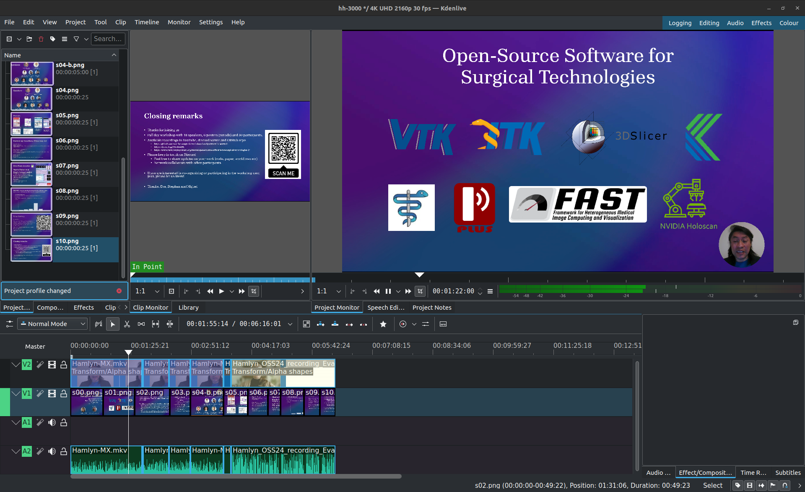

# Video edition

## Edit videos in Kdenlive Version 23.08.5
Croping, resizing, converting and adding circular videos to the slides were based on [Kdenlive](https://kdenlive.org/) (see the following screenshot).

Some references:
* How to Make a Circular Video or Talking Head Video in Kdenlive: https://www.youtube.com/watch?v=2U83ToyqUtU   
* Circular Video Crop in Kdenlive - Alpha Shapes: https://www.youtube.com/watch?v=W5BP8SZvhZM  
* Kdenlive How To Capture A Still Image From A Video: https://www.youtube.com/watch?v=htCVceyzNuI   

## Notes 
* Perhaps in the next iteration, we could consider using dedicated software to record the presentation, ensuring consistent resolution and avoiding video disruptions. Additionally, using a single microphone could help clearly capture both the speakers and audience questions during the Q&A session.

