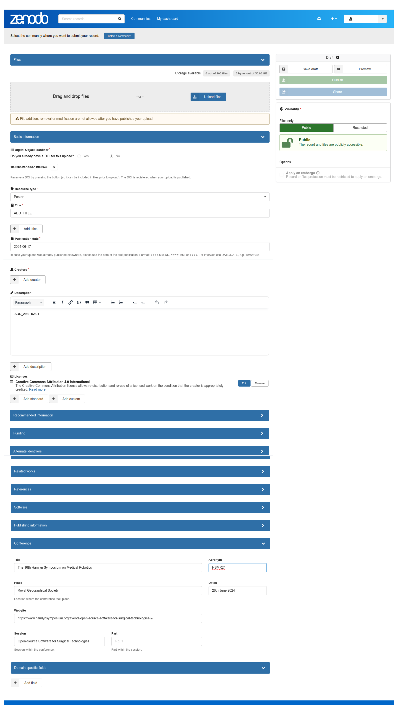

# Call for posters: Open-Source Software for Surgical Technologies
> Workshop at the 25th Hamlyn Symposium on Medical Robotics     
> Hamlyn Centre for Robotic Surgery -- 28th June 2024

Calling all attendees to share their insights and contributions through poster presentations focusing on Open-Source Software for Surgical Technologies. Your innovative work is welcomed and encouraged!

## Abstract
We welcome posters covering a diverse range of topics, including:
* (1) Open-source software libraries and frameworks, 
* (2) Medical and surgical software innovations,
* (3) Sustainability in open-source software,
* (4) Case studies showcasing novel applications and combinations of existing software,
* (5) Protocols for managing clinical data in computer-assisted software for surgical technologies, and 
* (6) Project summaries, methodological approaches, research findings, and initiatives related to Open-Source Software for Surgical Technologies.
Your contributions in these areas will enrich our discussions and advance the field!

Open-source software libraries for surgical technologies include areas on computer assisted surgery, medical robotics and medical imaging (e.g. SciKit-Surgery, 3DSlicer, Holohub, MONAI, PLUS, KitwareMedical, and FAST). These libraries have shown great progress in the last twenty years due to their rapid innovation and adaption to new technologies, continuous release of open software and datasets for algorithm evaluation, good documentation and educational resources for students, researchers, engineers and clinicians, and parentships between academia and industry. However, research-driven technologies bring new challenges on 1) using the latest generation of hardware, 2) ensuring fast prototyping and validation of new algorithms, 3) dealing with fragmented source code for heterogenous systems, 4) enabling high performance of medical image computing and visualisation in the operating room, and 5) ensuring standardisation of data quality and data privacy. Such challenges raise the question of how to transform open-source software libraries to be more sustainable, long-term supported and translatable to the clinic. 

## Awards
We are excited to announce that we will be recognising excellence with awards for the best poster and runner-up submissions. 

## Topic of interest
Topics of interest include (but are not limited to):
* Open source software libraries and frameworks
* Medical and Surgical Software
* Open-source software sustainability
* Case studies of existing open-source software in new ways and combinations
* Protocols to handle clinical data for computer assisted surgical technologies (e.g. ensuring patient privacy)
* Project summaries, methodological approaches, research findings, project summaries, and initiatives related to Open-Source Software for Surgical Technologies.

## Important dates
* Poster proposal submission deadline: 14th June, 2024 
* Notification of acceptance: 17th June, 2024 (providing further details to authors on Zenodo's DOIs submission)
* PDF poster submission deadline: 24th June, 2024
* Poster presentation: 28th June, 2024 

## Poster Proposal submission
We encourage open-source participation; however, we also want to ensure that authors have the option for both public and private submissions: 
* Public Option: Please submit your poster proposals by creating a [new issue](https://github.com/oss-for-surgtech/workshop-hamlyn2024/issues/new/choose) with the title of your poster, using poster submissions option ([Get started] button).
* Private Option: Please email poster proposal to eva.herbst@hest.ethz.ch and m.xochicale@ucl.ac.uk with subject: "poster submission to OSS4ST workshop. Details to include are author details, subtheme, poster title, and a brief description of your poster proposal in an abstract of 100 to 200 words (see this [template](https://github.com/oss-for-surgtech/workshop-hamlyn2024/blob/main/.github/ISSUE_TEMPLATE/poster_submission.md)).

## Poster template and instructions
We recommend to design poster with the following sections in a `A1` size. 
* Introduction
* Materials and Methods
* Results and Discussions
* Conclusions
* (Acknowledgments)
* References

## Poster submission
Please submit your poster proposals by creating a [new issue](https://github.com/oss-for-surgtech/workshop-hamlyn2024/issues/new/choose) with the title of your poster, using poster submissions option ([Get started] button).

## Zenodo DOI's for accepted poster
We have decided not to include proceedings this time to make the submission process easier and more accessible for everyone using our GitHub repository. 
Hence, we are requesting authors to submit their posters to Zenodo, providing authors with a formal citation option of their work (e.g., DOI):
1. Create an new zenodo submission https://zenodo.org/uploads/new 
2. Drag and drop your PDF poster 
3. Do you already have a DOI for this upload? Yes! Please add it or NO that automatically create a DOI for your poster.
4. Select resource type: “Poster”, TITLE, creators (names, ORCID, Affilication, Role), Description(abstract of your poster) 
5. Select Licence for our poster  
6. Add detials of the conference  
    **Title**: The 16th Hamlyn Symposium on Medical Robotics  
    **Acronym**: HSMR  
    **Place**:  Royal Geographical Society  
    **Dates**: 28th June 2024   
    **Website**: https://www.hamlynsymposium.org/events/open-source-software-for-surgical-technologies-2/   
    **Session**: Open-Source Software for Surgical Technologies
7. Please feel free any of the additional informaion to your poster: “recommended information”, “funding”, “alternative identifiers”, “related work”, “references”, “publishing infomraiton” and “domain specific fields”.

 

## Poster Presentation
* Authors must print posters to be presented in poster boards and in a 5-minutes spotlight talks!
* Organisers provide poster boards available for authors and respective material to setup poster
* Organiser can accommodate either one A0 poster portrait on each board, or two A1 landscape.

## Program Chairs
* Dr [Eva Herbst](https://evaherbst.github.io/personal_website/), ETH Zurich
* Dr [Stephen Thompson](https://scholar.google.com/citations?user=-rD4cJIAAAAJ&hl=en&oi=ao), University College London
* Dr [Miguel Xochicale](https://mxochicale.github.io/), University College London

## Contact 
For additional information please contact Eva Herbst at eva.herbst@hest.ethz.ch and Miguel Xochicale m.xochicale@ucl.ac.uk

